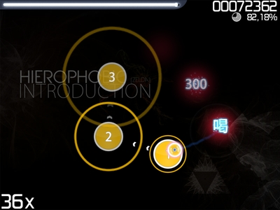
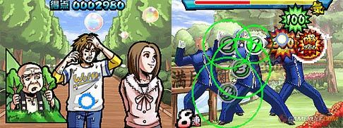

# osu!

*Main page: [Game Modes](/wiki/Game_Modes).*

osu!, sometimes referred to as *osu!standard* to differentiate between the game client and the game mode, is the first game mode 
of *osu!* and was derived from the *Ouendan* series.

To access the osu! game mode, press `Ctrl` + `1` or click on the `Mode` button and select `osu!`.

## Ouendan - What is it?

*[Osu! Tatakae! Ouendan](https://en.wikipedia.org/wiki/Osu!_Tatakae!_Ouendan)* is a rhythm game for the *Nintendo DS*. The gameplay consists of only three elements: tapping circles on the touchscreen, dragging a ball across a fixed path, and rotating a spinner very fast. All of these elements are timed to covers of popular Japanese songs. The image below is what it would have looked like on the *Nintendo DS*:

The circles can be seen on the bottom screen, while the story can be seen on the top screen. Each stage is basically a self-contained story about a person in trouble. That is where the Ouendan (Cheer squad) comes in. Through the magical power of male cheerleading, the player is able to help the people in trouble.

## Gameplay

osu! puts an emphasis on:

- Adaptability and reaction to stimuli (that is, the hittable objects appearing all over the screen at lightning speed).
- Understanding of the song's beat and design.
- Input device control.
- Timing of hits on the object that appeared on the screen.
- Ability to spin the mouse (or pen for tablet) on spinners.
- Physical stamina and mental fortitude (especially longer, marathon-type songs).
- Proper positioning and hand-eye coordination.

These are some of the vital skills to become an *osu! rhythm champion*.

## Controls

## See also

- [Hit Objects](/wiki/Hit_Objects/)
- [Play Styles](/wiki/Play_Styles/#-osu!)
- [Score](/wiki/Score/#-osu!)
